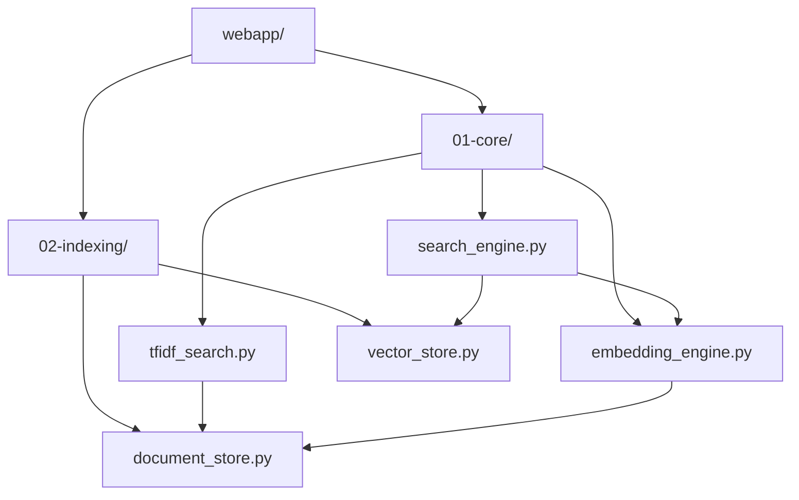

# 📁 Semantic Search Engine - Project Structure

Complete organization of the Week 3-4 semantic search project with webapp separation.

## 🏗️ Final Project Structure

```
03-semantic-search/
├── README.md                           # Complete project documentation
├── PROJECT_STRUCTURE.md               # This file
├── requirements_semantic_search.txt    # Core ML dependencies
├── FAISS_IMPLEMENTATION.md            # Technical implementation details
│
├── 01-core/                           # Core ML Components
│   ├── document_processor.py          # Text parsing & chunking
│   ├── embedding_engine.py            # Word2Vec + Sentence Transformers
│   ├── search_engine.py               # FAISS vector search
│   ├── tfidf_search.py                # Classical keyword search
│   └── hybrid_ranker.py               # Search fusion strategies
│
├── 02-indexing/                       # Storage & Indexing
│   ├── document_store.py              # Document metadata & caching
│   └── vector_store.py                # FAISS vector indices
│
├── webapp/                            # Web Application (Organized!)
│   ├── app.py                         # Production FastAPI app
│   ├── demo_app.py                    # Demo version (no ML deps)
│   ├── models.py                      # Pydantic request/response models
│   ├── start_web_interface.py         # Production startup script
│   ├── requirements_web.txt           # Web-specific dependencies
│   ├── Dockerfile                     # Container deployment
│   ├── docker-compose.yml             # Multi-container setup
│   ├── IMPLEMENTATION_SUMMARY.md      # Implementation overview
│   ├── WEB_INTERFACE_README.md        # Web interface documentation
│   └── static/                        # Frontend Assets
│       ├── index.html                 # Responsive search interface
│       ├── style.css                  # Modern CSS styling
│       └── script.js                  # Interactive JavaScript
│
├── sample_documents/                   # Test Dataset
│   ├── ai_overview.txt                # Artificial Intelligence overview
│   ├── machine_learning_basics.txt    # ML fundamentals
│   ├── deep_learning_explained.txt    # Deep learning concepts
│   ├── nlp_introduction.txt           # NLP basics
│   └── python_programming_guide.txt   # Programming guide
│
├── demo_storage/                      # Generated Data (Git ignored)
│   ├── document_store/                # Document metadata & embeddings
│   ├── vector_indices/                # FAISS indices
│   ├── embeddings_cache.json          # Embedding cache
│   └── tfidf_index.pkl                # TF-IDF model
│
└── Testing & Demo Scripts
    ├── simple_search_demo.py          # Quick system test
    ├── search_integration_demo.py     # Complete search demo
    └── test_document_processing.py    # Original comprehensive test
```

## 🎯 Usage Patterns

### Development & Testing
```bash
cd 03-semantic-search
python simple_search_demo.py           # Quick test
python search_integration_demo.py      # Full system demo
```

### Web Application
```bash
cd webapp
python demo_app.py                     # Demo mode (fast start)
python start_web_interface.py          # Production mode
```

### Deployment
```bash
cd webapp
docker-compose up --build              # Container deployment
```

## 📊 Component Dependencies



## 🎉 Benefits of Organization

### ✅ **Separation of Concerns:**
- **Core ML Logic**: Pure Python, framework agnostic
- **Web Interface**: FastAPI, HTML/CSS/JS in dedicated folder
- **Storage**: Centralized indexing and caching
- **Testing**: Clear demo and test scripts

### ✅ **Development Workflow:**
- **Research Phase**: Work in core/ and indexing/
- **Web Development**: Focus on webapp/ folder
- **Deployment**: Container-ready in webapp/
- **Testing**: Multiple entry points for different needs

### ✅ **Educational Value:**
- Clear progression from ML research to web deployment
- Separate webapp shows full-stack development skills
- Clean architecture suitable for portfolio demonstration
- Professional organization for bootcamp projects

## 🚀 Next Steps

With this organized structure, you can easily:
1. **Extend ML features** in core/ without touching web code
2. **Improve web interface** in webapp/ independently  
3. **Deploy anywhere** using the containerized webapp
4. **Add new search methods** following the established patterns
5. **Move to Week 5-6** with a clean, completed project

---

**Week 3-4 Semantic Search Engine: Complete & Production Ready! 🎉**